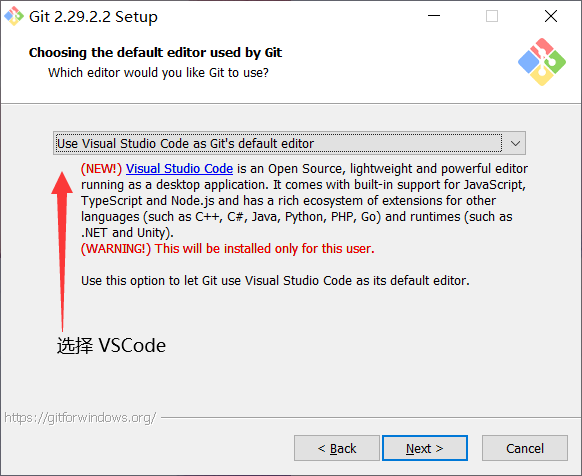

# GIT

[常用指令](https://mrhope.site/file/git/gitCheatSheet.pdf)


:::danger
安装时选择 VS Code 作为 git 得默认编辑器
:::




:::tip

GIT 使用 HEAD 作为指针指向版本链

1. 工作区
   1. 本地编辑的内容
2. 暂存区
   1. 修改的内容 add ，从工作区移动到暂存区
3. 版本库
   1. commit stage change，从暂存区移动到版本库内

- master
  - dev
    - people
  - bug
  

:::

## git基本设置

```bash
# 查看配置
git config --local --list
git config --global -l

# 设置 Proxy（端口使用vpn端口）
git config --global http.proxy http://127.0.0.1:7890
git config --global https.proxy https://127.0.0.1:7890

# 设置 用户名和邮箱
git config --local user.name "xxx"

git config --global user.email "xxx@qq.com"

# 删除属性
git config --global --unset http.proxy
git config --global --unset https.proxy

# 关闭ssl 校验

git config --global http.sslVerify “false”

# 创建 SSH KEY

ssh-keygen -t rsa -C "youremail@example.com"

```

## 仓库初始化

```bash

# QA 克隆远程仓库
git clone xxx.git

# QA 本地文件关联仓库
# 本地初始化
git init
git remote add origin xxx.git
# 注意Merge
git push origin main

# QA 更换仓库
# 删除关联关系
git  remote remove origin
git remote add origin xxx.git
# 改分支名称（github 上使用main）
git branch -m master main
# 设置提交到远程分支
git branch --set-upstream-to=origin/main main
# 设置远程仓库 head 指向当前分支
git remote set-head origin -a
git push -f origin main
git push -u origin main

```

## 远程仓库

```bash
# 添加远程仓库，本地命名为 origin
git remote add origin xxx.git
# 删除远程仓库 origin
git  remote remove origin

# 获取远程仓库得数据，但是不会自动合并，不会影响当前得工作
git fetch <remote>

# 推送本地数据到远程仓库
git push <remote> <branch>

# 查看远程仓库信息
git remote show <remote>

# 修改远程仓库名称
git remote rename pb paul

```

## 查看当前状态信息

`git status`


## 补提交

```bash
# 补提交上次的commit（未 push）
git commit --amend


```

## 版本回退

```bash
# 回退上一个版本
git reset --hard HEAD^

# 回退到指定的版本，id 可以只输入前 6 位（回退版本后，之后的修改提交都将丢失，请慎重）
# 实质上是 head 指针指向提交，所以如果记得最后版本的 id，也可以重新将 指针指向 最后版本）
git reset --hard <commit id>

# 回退文件版本
git reset --hard <commit id> <file name>

# 找回 commit id
git reflog

```

## 撤销/删除文件

撤销 commit（un push）

1. `git reset HEAD <file>`
2. `git checkout -- <file>`

```bash
# 抛弃当前修改，将文件还原成最后一次提交
# 危险！！这是一个危险命令，可能造成数据丢失
git checkout -- <file>

# 把暂存区的修改撤销掉(unstage)
git reset HEAD <file>

# 丢弃工作区与暂存区的全部文件
git reset --hard HEAD

# 从git中删除文件
git rm <file>
git commit

# 撤销工作区删除

git checkout -- test.txt

```

## 分支管理

```bash

# 查看分支
git branch

# 创建分支
git branch <branchname>

# 切换分支
git checkout <branchname>

# 移回到主干，合并分支 
$ git checkout master
$ git merge <branchname>

# 删除分支
git branch -d <branchname>
# 强制删除分支
git branch -D feature-vulcan

# 推送分支
git push origin <branchname>

# 将 branch1的commit1 合并到branch2当中
# 切换到branch2中，然后执行如下命令：
git cherry-pick commit1

# 同时创建 本地 与 远程仓库 分支
git checkout -b dev origin/dev

# 设置 dev 和 origin/dev 的链接:
git branch --set-upstream-to=origin/dev dev


```

# 合并冲突

合并分支时，提示合并冲突，进入vscode 资源管理，查看冲突文件，手动合并完成后，commit即可

## stash 

1. 将 dev 工作区 暂存起来 git stash
2. 切换分支 到bug 分支
3. 修复bug
4. 切回 dev 分支
5. git stash pop
6. 还原工作区，继续开发
## .gitignore

```text

*.pdf

build/

doc/*.txt

!lib.pdf

```

```bash
# 查找冲突规则

git check-ignore -v file.name

```


## tag

标签默认存在本地，与 commit id 绑定，可以推送标签至远程，删除远程标签比较麻烦


:::tip

下载指定 tag 的代码进行发布

`git clone --branch <tagname> xxx.git`
:::

```bash
# 打标签 （说明 / 指定标签位置）
git tag [-a] <tagname> [-m "info"] [commit id]

# 查看标签
git tag

# 查看标签详情
git show <tagname>

# 删除本地标签
git tag -d <tagname>

# 推送标签至远程
git push origin <tagname>
# 推送所有标签至远程
git push origin --tags

# 删除远程标签
# 先删除本地标签，再删除远程标签
git tag -d <tagname>
git push origin :refs/tags/<tagname>

```

## rebase 