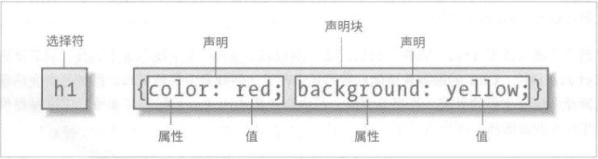
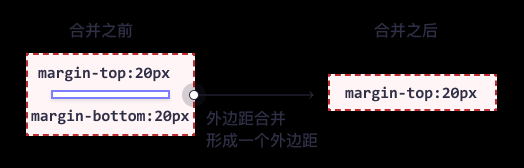
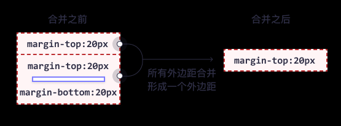
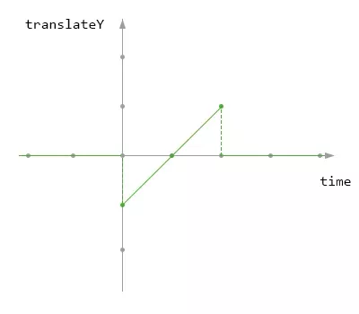
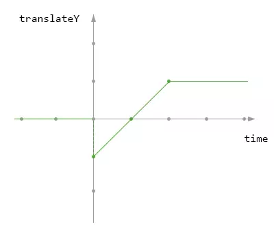
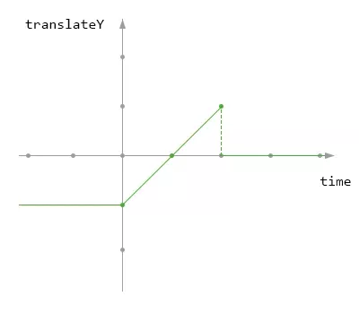
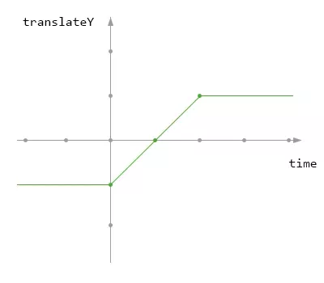

# CSS笔记

> replaced element
> Nonreplaced element

块级元素
行内元素

大小写敏感，默认全部小写

## stylesheet

```html

<html>
    <head>
        <title></title>
        <meta ...>
        <link>
        <style>
    </head>

    <body>
    </body>
</html>

```

---

`外部样式表`  放再 head 元素内

文档样式表

嵌入式样式表

行内样式

首选样式表
--不同标题将导致只有一个第一个标题样式表生效

候选样式表

永久样式表

```css

/* 使用 @import 必须放在 style 元素中，且再其他的css 规则前，
一个style 元素可以放置多个元素， 
可以在外部样式表中使用 @import 引用其他外部样式表，必须放再其他的css 规则前 */

<style type="text/css ">

    @import url(sheet.css);

</style>
```

> 样式表内不能有标记符



css 不支持 嵌套注释

---

媒体查询

媒体 类型

媒体描述符

特性查询

## 选择器

### 属性

群组选择符

通用选择符 `*`

类选择符

```html
<style type="text/css">
    /* 类选择器写在一起，表示同时拥有这两个类的元素，与顺序无关 */
    p.prop-1.prop-2 {
    color: #ccc;
    }

</style>

<!-- 可以拥有多个类，空格隔开，命名规则使用小写 -->
<p class="prop-1 prop-2 ">倒霉孩子</p>

```

ID选择符

```html
<style type="text/css">
    /* 由于 ID 唯一，所以通常不标明 元素类型*/
    p#unique {
        color:#fff
    }

</style>

<!-- 一个元素仅能有一个id，该id 在文档中唯一，不可以使用空格分隔 -->
<p class="prop-1 prop-2 " id="unique">倒霉孩子</p>

```

> ID选择符的样式权重 > 类选择符

属性选择符

```css
/* 简单属性选择符 */
a[alt][title] {fon-weight:bold;}

/* 精准属性值选择符
    如果属性有多个值，则顺序要相同才可以匹配 */
a[alt="#"] {fon-weight:bold;}

/* 部分匹配属性值选择符 (有多种部分匹配符)*/
a[alt|="en"] {color:white;}

/* 起始值属性选择符 */
/* 不区分大小写标识符 */
```

### 结构

祖辈元素（上层）
后代元素（下层）
特例：连续元素 可以叫做 父元素 和 子元素

```css
/* 后代选择符（上下文选择符，后代元素都生效 */
/* ul 下的所有后代 li 元素 */
ul li {color:#fff;}

/* 子连接符 > ,子元素生效 */
ul>li {color:#fff;}

/* 紧领同胞连接符  +，选择紧临的同级元素，中间如果有其他同级或者子级元素，不生效 */
h1+p {color:#fff;}
/* 一般同胞连接符 ~， 选择 后续所有同级元素*/
ul~li {color:#fff;}

```

### 伪类

伪类允许拼接

`结构伪类`

:root
:empty
:only-child
:only-of-type
:first-child
:last-child
:first-of-type
:last-of-type

:nth-child(2n+1)
//n取值0，1，2，3.  html元素是从一开始计算的
nth-child(odd) //奇数
nth-child(even) //偶数
:nth-last-child(2n+1)

:nth-of-type()
:nth-last-of-type()

`动态伪类`

> 链接伪类

link
visited

> 用户操作伪类

focus（注意和ui状态伪类区分）
hover
active

排列有先后顺序要求

link-visited-hover-active
---

`UI状态伪类`

enabled
disabled
checked
default

>可选性伪类

required
optional（required 属性为false 也可匹配）

> 有效性伪类

valid
invalid

> 范围伪类

in-range
out-of-range

>可变性伪类

read-write
read-only

5. target 伪类
6. lang 伪类 lang(fr)
7. lang 伪类 lang(fr)
8. 否定伪类 :not(xxx)
   1. 可以串联
   2. 不可以嵌套

#### 伪元素选择符

伪元素只能在选择符的最后
一个选择符中只能有一个伪元素

1. ::first-letter
2. ::first-line （修饰块级元素）
3. ::before
4. ::after

## 特异性 和 层叠

### 特异性（specificity）

通用符 连接符 特指度

继承，层叠

```css

/* 重要声明 > 非重要声明 */

p.dark {color: #333 !important; background: white;}


```

特异性（specificity）相同时，最新规则覆盖旧规则

继承的属性 specificity 为 0，使用通用符设置的属性无 specificity，所以 继承 特异性大于 通用符

ID 选择器比属性选择器拥有更高的特异性

`#id > *[id="id"]`

上下文选择器比单一元素选择器更具体 - 嵌入式样式表更靠近要设置样式的元素

类选择器会击败任意数量的元素选择器 - 类选择器（诸如 .intro 会击败 h1、p、div 等）

行内样式 - 行内（内联）样式直接附加到要设置样式的元素。实例：<h1 style="color: #ffffff;">。

ID - ID 是页面元素的唯一标识符，例如 #navbar。

类、属性和伪类 - 此类别包括 .classes、[attributes] 和伪类，例如：:hover、:focus 等。

元素和伪元素 - 此类别包括元素名称和伪元素，比如 h1、div、:before 和 :after。


盒模型属性不继承

inherit 继承来的属性有特指度

### 层叠

权重
来源
特指度
先后顺序

链接 LVFHA

## 值与单位

1. 值
   1. 关键字
      1. none/underline..
      2. 全局关键字 (属性值all)
         1. inherit
         2. initial
         3. unset
   2. 字符串
      1. 注意引号配对
      2. 转义
   3. url
      1. 相对路径
      2. 绝对路径
      3. 其他服务器上的相对路径
      4. `body {background: url(images/icon.png)}` url 与 括号之间不能有空格，
   4. image
      1. url
      2. image-set
      3. gradient
   5. 标识符
      1. identifier
2. 数字与百分数
   1. 整数
   2. 数字
   3. 百分数
   4. 弹性值
   5. 距离
      1. 绝对长度单位 in cm mm q pt pc px 
      2. 相对长度单位 em ex rem ch
      3. 视区单位   vw vh vmin vmax
      4. 计算值 calc() 20个算子
3. 颜色
   1. 具名2颜色
   2. RGB RGBa(整数和百分数不能混用)，alpha->opacity 不透明度 只能在0-1之间，不能用百分数
   3. HSL HSLa
   4. transparent
   5. currentColor
4. angle 
   1. deg
   2. grad
   3. rad
   4. turn
5. 时间 频率
   1. s ms
   2. hz khz
6. 位置
7. 自定义值

## 字体

1. 通用字体族
2. 使用引号
   1. 字体名称存在空格 或者 符号
   2. 区别于字体族
3. font-face
   1. 懒加载
   2. 但是浏览器实现时会提前全部下载
4. 兼容性载入
5. font-style
6. font-weight
   1. normal(400) bold(700) bolder lighter 100-900
7. font: font-size 和 font-family 的值是必需的

## 文本属性

1. 段落格式
   1. 缩进 text-indent
   2. 文本方向对齐 text-align
      1. justify 两端对齐
   3. text-align-last > text-align
   4. text-transform

衬线字体（Serif）- 在每个字母的边缘都有一个小的笔触。它们营造出一种形式感和优雅感。
无衬线字体（Sans-serif）- 字体线条简洁（没有小笔画）。它们营造出现代而简约的外观。
等宽字体（Monospace）- 这里所有字母都有相同的固定宽度。它们创造出机械式的外观。
草书字体（Cursive）- 模仿了人类的笔迹。
幻想字体（Fantasy）- 是装饰性/俏皮的字体。

### 行高的继承

## 表格

```css
/* 表格 边框折叠 */
table {
  border-collapse: collapse;
}


```

## flex
 flex-wrap: wrap;
flex-flow
align-content

## display:none visibility:hidden

position: absolute; 的元素相对于最近的定位祖先元素进行定位（而不是相对于视口定位，如 fixed）。

然而，如果绝对定位的元素没有祖先，它将使用文档主体（body），并随页面滚动一起移动。

注意：“被定位的”元素是其位置除 static 以外的任何元素（如果父元素是 static，那么就找上一级父元素，直到找到属性非static 的元素 或者 body 元素）。

## 背景

```css
html {
   background-color: #ffffff33;
}
body {
  background-image: url("paper.gif");
    background-repeat: repeat-x;
    /* value no-repeat can no repeat */
    background-position: right top;
}

```

## 盒模型

盒模型不会继承

```css
/* border-box 的元素  border + padding + 内容的大小 等于width */
p {

   width: 100px;
   box-sizing: border-box;//content-box
}
```

### border

border-style 中 none 和 hidden 的区别： 在表格中可能发生边框冲突，这个时候，none 的优先级最低，显示其他边框样式。 hidden 优先级最高，不显示样式。

### margin

只有普通文档流中块框的`垂直外边距`才会发生外边距合并。行内框、浮动框或绝对定位之间的外边距不会合并。

假设有一个空元素，它有外边距，但是没有边框或填充。在这种情况下，上外边距与下外边距就碰到了一起，它们会发生合并：



如果这个外边距遇到另一个元素的外边距，它还会发生合并：




## draft

z-index 作用于 定位元素，值为自然数，范围在 正负一定范围内。如果没有声明，则按元素的默认值排序，默认值相同，后者覆盖前者。数值越大，层数越高

overflow auto - 与 scroll 类似，但仅在必要时添加滚动条

float
clear

清除浮动

```css
/* 浮动子元素 大于 父元素时，使用以下方法 避免溢出 */
.clearfix {
  overflow: auto;
}

/* 或者一下方法 */

.clearfix::after {
  content: "";
  clear: both;
  display: table;
}

```

overflow：hidden 作用


1. 溢出隐藏
2. 清除浮动
3. 解决外边距塌陷

float : fixed/sticky
position:relative

## animation

animation 是可以接收多个动画

```css

div {
    animation: falldown 2s, fadeIn 2s;
}

@keyframes falldown {
    100% {
        transform: translate(0, 150px);
    }
}
@keyframes fadeIn {
    100% {
        opacity: 0;
    }
}

```

在 CSS 动画 @keyframes 的定义中，from 等同于 0%，而 to 等同于 100%。


元素 自身样式 与 动画 开始结束 样式关系 （与 循环次数（可以小数） 和 方向 有关）

- animation-fill-mode: none

动画结束后回到默认样式



- animation-fill-mode: forwards



- animation-fill-mode: backwards



- animation-fill-mode: both

动画保持 初始和结束关键帧的样式



### 动画优化

#### 使用 GPU 加速 

（局部生成  GraphicsLayer  重绘）


- 3D 或透视变换(perspective、transform) CSS 属性
- 使用加速视频解码的
- 拥有 3D (WebGL) 上下文或加速的 2D 上下文的 元素
- 混合插件(如 Flash)
- 对自己的 opacity 做 CSS 动画或使用一个动画变换的元素
- 拥有加速 CSS 过滤器的元素
- 元素有一个包含复合层的后代节点(换句话说，就是一个元素拥有一个子元素，该子元素在自己的层里)
- 元素有一个 z-index 较低且包含一个复合层的兄弟元素(换句话说就是该元素在复合层上面渲染)

#### 减少使用耗性能样式

#### will-change

1. 不要应用在太多元素
2. 使用后 浏览器会更长久得保存，最佳实践： 当元素变化之前和之后通过脚本来切换 will-change 的值。


##  @property
## svg

 transition 过渡

 通过媒体查询 完成响应式

 ```css
 @media screen and (max-width:1000px) {
  .col-25, .col-75 {
    width: 99%;
    margin-top: 0;
  }
}
 
 ```


## 计数器 

计数器 可以嵌套

background-clip和background-origin的区别

overflow

float

position

transform 
transform-origin

```css
/* 全局变量 */
:root {
  --blue: #1e90ff;
  --white: #ffffff;
}

/* 在相应的选择器内声明 局部变量 近在该选择器内生效 */

button {
  --blue: #0000ff;
  background-color: var(--white);
  color: var(--blue);
  border: 1px solid var(--blue);
  padding: 5px;
}

/* 使用变量时，可以填写 回退值 */
div {
   color: var(--blue);
   background-color: var(--blue,#123)
}
```