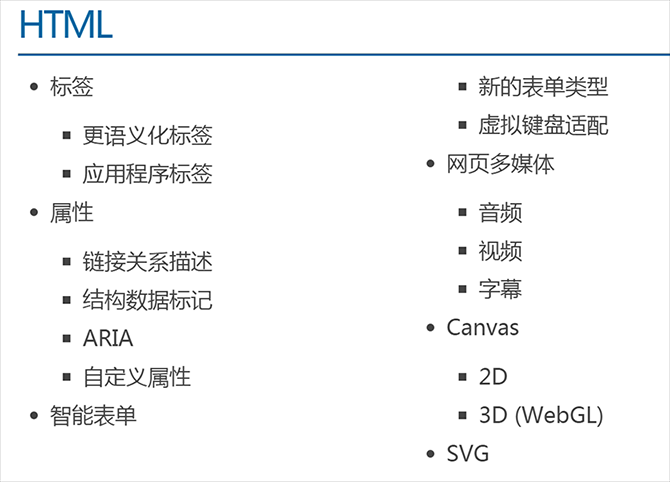

html
 HyperText Markup Language

不是编程语言，是标记语言
标记语言没有编译过程，HTML标签是直接由浏览器解析执行

标签负责描述语义而不是样式

html版本区别
html  4 5
xhtml 

单边标记

<br />、<hr />和

DTD DocType Declaration

<!DOCTYPE html> DTD
html 语言 en zh-CN
<html lang="en">

<head>
    <meta charset="UTF-8">
视口宽度等于屏幕宽度，初始缩放100%
    <meta name="viewport" content="width=device-width, initial-scale=1.0">
字符集
	<meta http-equiv="Content-Type" content="text/html;charset=UTF-8">
	<meta name="Author" content="">
    <meta name="Keywords" content="厉害很厉害" />
    <meta name="Description" content="网易是中国领先的互联网技术公司，为用户提供免费邮箱、游戏、搜索引擎服务，开设新闻、娱乐、体育等30多个内容频道，及博客、视频、论坛等互动交流，网聚人的力量。" />
base 标签用于指定基础的路径。指定之后，所有的 a 链接都是以这个路径为基准
<base href="/">

    <title>Document</title>
</head>
<body>

</body>
</html>

干净的网页

div  p  h1  span   a   img   ul   ol    dl    input

转义字符

<i>

列表

ul  ol 

dl
dl dt dd

嵌套

```html

<ul>
    <li>层级一
        <ul>
            <li>层级二</li>
        </ul>
    </li>
</ul>

```

table 
tr
td
caption
thead
tbody
tfoot

iframe


form
input

select option

<textarea>

fieldset legend
<input type="radio" name="sex" id="nan" /> <label for="nan">男</label>
表单元素都可以绑定 label，label 的属性值与表单元素的id 相同，即可绑定，





H5 新增 表单类型
email 只能输入email格式。自动带有验证功能。

tel 手机号码。

url 只能输入url格式。

number 只能输入数字。

search 搜索框

range 滑动条

color 拾色器

time 时间

date 日期

datetime 时间日期

month 月份

week 星期

DOM

自定义属性
H5可以直接在标签里添加自定义属性，但必须以 data- 开头。

js  box.dataset["content"] = "aaaa";


video 

video.paused
video.play
 video.oncanplay
video.duration
video.currentTime

video.ontimeupdate
 video.requestFullscreen();

  <div class="box1" draggable="true"></div>
拖拽元素
目标元素

html
常见元素

head
meta

title

style

link

script

base

2、html 元素（body 区域）
body 区域的 html 元素，会直接出现在页面上。

div、section、article、aside、header、footer

p

span、em、strong

表格元素：table、thead、tbody、tr、td

列表元素：ul、ol、dl、dt、dd

a

表单元素：form、input、select、textarea、button datalist

h5 拖拽
历史
地理位置


全屏


H5 storage

H5 中有两种存储的方式
1、window.sessionStorage 会话存储：

保存在内存中。

生命周期为关闭浏览器窗口。也就是说，当窗口关闭时数据销毁。

在同一个窗口下数据可以共享。

2、window.localStorage 本地存储：

有可能保存在浏览器内存里，有可能在硬盘里。

永久生效，除非手动删除（比如清理垃圾的时候）。

可以多窗口共享。

#Web 存储的特性
（1）设置、读取方便。

（2）容量较大，sessionStorage 约5M、localStorage 约20M。

（3）只能存储字符串，可以将对象 JSON.stringify() 编码后存储。


网络状态


缓存清单文件


1、可配置需要缓存的资源；

2、网络无连接应用仍可用；

3、本地读取缓存资源，提升访问速度，增强用户体验；

4、减少请求，缓解服务器负担。

demo.appcache


CACHE MANIFEST


#要缓存的文件

CACHE:

    images/img1.jpg

    images/img2.jpg


#指定必须联网才能访问的文件

NETWORK:

     images/img3.jpg

     images/img4.jpg


#当前页面无法访问是回退的页面

FALLBACK:

    404.html