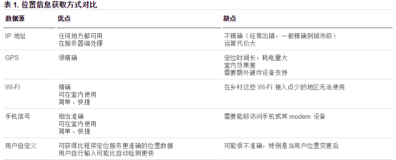

# HTML

HyperText Markup Language

不是编程语言，是标记语言
标记语言没有编译过程，HTML标签是直接由浏览器解析执行

标签负责描述语义而不是样式

html版本区别

html，xhtml 

## 语法

body 区域的 html 元素，会直接出现在页面上。

div、section、article、aside、header、footer

p

span、em、strong

表格元素：table、thead、tbody、tr、td

列表元素：ul、ol、dl、dt、dd

a

表单元素：form、input、select、textarea、button datalist


``` html 

<!-- DTD DocType Declaration ,html 指html5版本，xhtml -> 严格版-->
<!DOCTYPE html>
<!-- 标记页面使用国际语言 方便浏览器 进行国际化操作 en zh-CN-->

<html lang="en">

<head>
    <!-- 字符集网页编码 -->
    <meta charset="UTF-8">
<!-- 设置视口宽度等于设备屏幕宽度，初始缩放100% -->
    <meta name="viewport" content="width=device-width, initial-scale=1.0">
<!-- 上方写法为缩写 -->
	<meta http-equiv="Content-Type" content="text/html;charset=UTF-8">
	<meta name="Author" content="">
    <!-- 便于seo -->
    <meta name="Keywords" content="厉害很厉害" />
    <meta name="Description" content="网易是中国领先的互联网技术公司，为用户提供免费邮箱、游戏、搜索引擎服务，开设新闻、娱乐、体育等30多个内容频道，及博客、视频、论坛等互动交流，网聚人的力量。" />
<!-- base 标签用于指定基础的路径。指定之后，所有的 a 链接都是以这个路径为基准 ，慎重使用-->
<base href="/">
    <!-- 样式 -->
    <style> </style>
    <!-- 导入外部资源 css js font  -->
    <link>

    <title>Document</title>
</head>
<body>

</body>
</html>

```

### 列表

ul  ol 

- dl (definition list)
  - dt (definition title)
  - dd (definition description)

支持嵌套

```html

<ul>
    <li>层级一
        <ul>
            <li>层级二</li>
        </ul>
    </li>
</ul>

```

<ul>
    <li>层级一
        <ul>
            <li>层级二</li>
        </ul>
    </li>
</ul>

### 表格

table 
tr
td
caption

使用下面的标签 便于数据量太大时分别加载，提高体验
thead
tbody
tfoot

### 超链接

```html
<!-- href 链接， target 跳转方式，当前页面，新页面 或指定 iframe -->
<a href="http://" target="_blank" rel="noopener noreferrer"></a>

```

### 表单

form

input

fieldset 包裹

legend 包裹

label 标签 `for` 绑定 表单元素 id 后，点击label 可以响应表单操作

<fieldset>
    <legend>区域标题</legend>
    <label for="">
        性别：
        <input type="checkbox" name="sex" id="man">
        <label for="man">男</label>
    </label>
    <br/>
    <label for="">
        爱好:
        <input type="checkbox" name="sex" id="women">
        <label for="women">女</label>
    </label>
</fieldset>

```html

<fieldset>
    <legend>区域标题</legend>
    <label for="">
        性别：
        <input type="checkbox" name="sex" id="man">
        <label for="man">男</label>
    </label>
    <br/>
    <label for="">
        爱好:
        <input type="checkbox" name="sex" id="women">
        <label for="women">女</label>
    </label>
</fieldset>

```

select

属性  size/multiple

<select name="test" id="select1">
    <option value="1">1</option>
    <option value="2">2</option>
    <option value="3">3</option>
</select>

```html

    <select name="test" id="select1">
        <option value="1">1</option>
        <option value="2">2</option>
        <option value="3">3</option>
    </select>

```

## H5 新功能


### HTML

- 新增 表单类型
- 
email 只能输入email格式。自动带有验证功能。

tel 手机号码。

url 只能输入url格式。

number 只能输入数字。

search 搜索框

range 滑动条

color 拾色器

time 时间

date 日期

datetime 时间日期

month 月份

week 星期

### JS

DOM

自定义属性
H5可以直接在标签里添加自定义属性，但必须以 data- 开头。

js  box.dataset["content"] = "aaaa";


#### video

事件

video.paused
video.play
 video.oncanplay
video.duration
video.currentTime

video.ontimeupdate
 video.requestFullscreen();

#### 拖拽事件

```html
<!-- 该元素为拖拽元素 -->
<div class="box1" draggable="true"></div>
<!-- 该元素为目标元素 -->
<div class="aim"></div>

```

```js
// 拖拽元素的事件监听：（应用于拖拽元素）

// ondragstart当拖拽开始时调用

// ondragleave 当鼠标离开拖拽元素时调用

// ondragend 当拖拽结束时调用

// ondrag 整个拖拽过程都会调用
//------------------------------------------
// 目标元素的事件监听：（应用于目标元素）

// ondragenter 当拖拽元素进入时调用

// ondragover 当拖拽元素停留在目标元素上时，就会连续一直触发（不管拖拽元素此时是移动还是不动的状态）

// ondrop 当在目标元素上松开鼠标时调用

// ondragleave 当鼠标离开目标元素时调用

    // 当拖拽元素在 目标元素上时，连续触发
    two.ondragover = function (e) {
        //阻止拖拽事件的默认行为
        e.preventDefault(); //【重要】一定要加这一行代码，否则，后面的方法 ondrop() 无法触发。

        console.log("over...");
    }

    // 当在目标元素上松开鼠标是触发
    two.ondrop = function () {
        console.log("松开鼠标了....");
    }


```

#### 历史

`window.history` 用于不刷新的情况下更新页面数据

常用于单页应用

window.history.forward(); // 前进

window.history.back(); // 后退

window.history.go(); // 刷新

window.history.go(n); //n=1 表示前进；n=-1 后退；n=0s 刷新。如果移动的位置超出了访问历史的边界，会静默失败，但不会报错。

通过JS可以加入一个访问状态

history.pushState; //放入历史中的状态数据, 设置title(现在浏览器不支持改变历史状态)

#### 地理位置




#### 全屏

- 全屏的伪类

```css
:full-screen .box {}

:-webkit-full-screen {}

:moz-full-screen {}
```

```js

// document.fullScreen 判断当前是否全屏
// cancleFullscreen()    //让元素关闭全屏显示

  var box = document.querySelector('.box');
    // box.requestFullscreen();   //直接这样写是没有效果的。之所以无效，应该是浏览器的机制，必须要点一下才可以实现全屏功能。
    document.querySelector('.box').onclick = function () {
        // 开启全屏显示的兼容写法
        if (box.requestFullscreen) {  //如果支持全屏，那就让元素全屏
            box.requestFullscreen();
        } else if (box.webkitRequestFullScreen) {
            box.webkitRequestFullScreen();
        } else if (box.mozRequestFullScreen) {
            box.mozRequestFullScreen();
        }

    }

```

#### 存储 storage

Web 存储的特性

（1）设置、读取方便。

（2）容量较大，sessionStorage 约5M、localStorage 约20M。

（3）只能存储字符串，可以将对象 JSON.stringify() 编码后存储。


1、window.sessionStorage 会话存储：

保存在内存中。

生命周期为关闭浏览器窗口。也就是说，当窗口关闭时数据销毁。

在同一个窗口下数据可以共享。

2、window.localStorage 本地存储：

有可能保存在浏览器内存里，有可能在硬盘里。

永久生效，除非手动删除（比如清理垃圾的时候）。

可以多窗口共享。

#### 网络状态

```js

 window.addEventListener('online', function () {
        alert('网络连接建立！');
    });

    window.addEventListener('offline', function () {
        alert('网络连接断开！');
    })

```


#### 应用缓存

HTML5中我们可以轻松的构建一个离线（无网络状态）应用，只需要创建一个 cache manifest 缓存清单文件。

1. 可配置需要缓存的资源；
2. 网络无连接应用仍可用；
3. 本地读取缓存资源，提升访问速度，增强用户体验；
4. 减少请求，缓解服务器负担。

缓存清单文件中列出了浏览器应缓存，以供离线访问的资源。推荐使用 .appcache作为后缀名，另外还要添加MIME类型。

demo.appcache

（1）顶行写CACHE MANIFEST。

（2）CACHE: 换行 指定我们需要缓存的静态资源，如.css、image、js等。

（3）NETWORK: 换行 指定需要在线访问的资源，可使用通配符（也就是：不需要缓存的、必须在网络下面才能访问的资源）。

（4）FALLBACK: 换行 当被缓存的文件找不到时的备用资源（当访问不到某个资源时，自动由另外一个资源替换）。

```profile

CACHE MANIFEST

#要缓存的文件
CACHE:
    images/img1.jpg
    images/img2.jpg


#指定必须联网才能访问的文件
NETWORK:
     images/img3.jpg
     images/img4.jpg


#当前页面无法访问是回退的页面
FALLBACK:
    404.html

```

在需要应用缓存在页面的根元素(html)里，添加属性manifest="demo.appcache"。路径要保证正确。例如：

```html
<!DOCTYPE html>
<html manifest="01.appcache">
<head lang="en">
    <meta charset="UTF-8">
    <title></title>
</head>
```

## 进阶

### 元素分类

inline

inline-block

单边标记

`<br />、<hr />和`

### 转义字符

展示 `<a>a</a>` 会被浏览器转义成  <a>a</a>

需要使用转义字符替换

`&lt; a &gt;`

- 常用转义字符

`&nbsp;`：空格 （non-breaking spacing，不换行空格）
`&lt;`：小于号（less than）
`&gt;`：大于号（greater than）

<i> 原来用于表示斜体，由于简短， ICON  单词首字母相同，常用于展示图标

### 自闭合元素

input  
img  
br hr  
meta link  