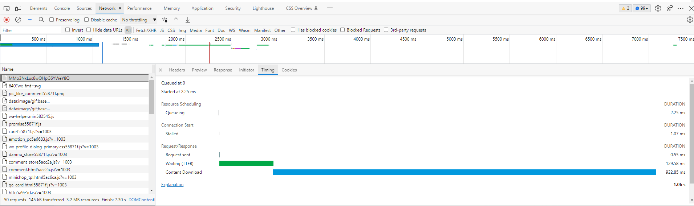

## 网页优化

## 网络加载



- Queued、Queueing：如果是HTTP/1.1的话，会有队头阻塞，浏览器对每个域名最多开 6 个并发连接。
- Stalled：浏览器要预先分配资源，调度连接。
- DNS Lookup：DNS解析域名。
- Initial connection、SSL：与服务器建立连接，TCP握手，当然你是https的话还有TLS握手。
- Request sent：服务器发送数据。
- TTFB：等待返回的数据，网络传输，也就是首字节响应时间。
- Content Dowload：接收数据。

### gzip-减少加载体积

1. 打包时，使用gzip 打包
2. nginx 配置
   1. gzip_static 优先返回 `.gz` 文件
   2. `gzip` 的开启是针对于请求文件的实时压缩
      1. 注意： 会消耗cpu资源
      2. 适用于文本资源，图片资源效果不好（`gzip_types`进行配置）

### 缓存控制

Last-Modified

Etag：分布式可能会有异常，可以只是用 Last-Modified

强缓存： 比对hash，如果文件 hash 没有变化，直接从缓存中获取

可以设置 缓存有效时间

强制刷新： 开启强缓存后，如果遇到错误的数据，需要强制刷新才能避免重复使用 错误的缓存内容。 `Ctrl+F5`  或者勾选控制台的  `Disable cache` 

### 长链接

TCP 和 LTS 的握手过程比较费时， 可以使用长链接来减少握手开销

Nginx 长链接默认 75s

```c

keepalive_timeout 75;
keepalive_requests 100;

```

### HTTP/2

头部压缩、虚拟的“流”传输、多路复用

HSTS-减少302重定向

Session Ticket-https会话复用 ( 开启TLS1.2 以上的协议)